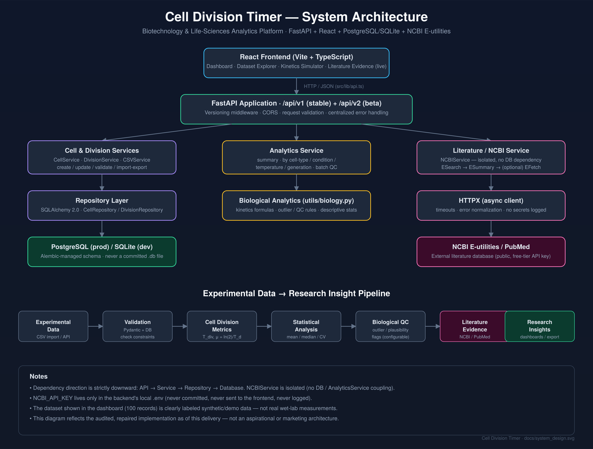

# 🧬 Cell Division Timer

**A quantitative cell-cycle kinetics & biological data analysis platform**


**Cell Division Timer** is a biotechnology-focused software platform for recording, validating, analyzing, and interpreting **cell division and cell-cycle kinetics data** generated from time-lapse microscopy and laboratory experiments.

The platform combines **cell biology, quantitative kinetics, database engineering, REST API development, statistical analysis, and biological quality control** into a single application — designed as a foundation for future integration with **live-cell imaging systems, laboratory information management systems (LIMS), computational biology pipelines, and bioprocess analytics platforms**.

---

## 📑 Table of Contents

- [Why This Project?](#-why-this-project)
- [Biological Problem](#-biological-problem)
- [Biological Quality Control](#-biological-quality-control)
- [System Architecture](#️-system-architecture)
- [Technology Stack](#️-technology-stack)
- [Project Structure](#-project-structure)
- [Database Design](#️-database-design)
- [Synthetic Benchmark Dataset](#-synthetic-benchmark-dataset)
- [API Reference](#-api)
- [Analytics API](#-analytics-api)
- [Literature Evidence (NCBI/PubMed)](#-literature-evidence-ncbi--pubmed)
- [CSV Data Transfer](#-csv-data-transfer)
- [API Versioning](#-api-versioning)
- [Local Installation](#-local-installation)
- [Database Setup](#️-database-setup)
- [Seed Synthetic Data](#-seed-synthetic-data)
- [Start the API](#️-start-the-api)
- [API Documentation](#-api-documentation)
- [Docker](#-docker)
- [Testing](#-testing)
- [Example Analytical Workflow](#-example-analytical-workflow)
- [Potential Real-World Applications](#-potential-real-world-applications)
- [Future Roadmap](#-future-roadmap)
- [Scientific Disclaimer](#️-scientific-disclaimer)
- [Contributing](#-contributing)
- [License](#-license)
- [Author](#-author)

---

## 🎯 Why This Project?

Cell-division experiments can generate hundreds or thousands of observations across:

- Different cell lines
- Experimental conditions
- Temperatures
- Biological replicates
- Generations
- Experimental batches
- Microscopy sessions

Manually organizing and analyzing these observations creates problems with data consistency, reproducibility, quality control, kinetic calculations, outlier identification, experimental comparison, and downstream export.

**Cell Division Timer** addresses this by providing a structured system for storing observations and automatically deriving biologically meaningful kinetic parameters.

---

## 🔬 Biological Problem

The platform focuses on quantitative measurements associated with cellular proliferation and division.

### 1. Division Duration

The active division/mitotic duration is calculated as:

$$
T_{div} = \frac{t_{end} - t_{start}}{60}
$$

where:

- $t_{start}$ = beginning of observed division
- $t_{end}$ = completion of division
- $T_{div}$ = division duration in minutes

### 2. Cell-Cycle / Generation Time

The system records $T_d$, the time required for a cell lineage to complete one generation. This provides a basis for comparing proliferation kinetics under different experimental conditions.

### 3. Specific Growth Rate

For an exponentially growing population:

$$
N(t) = N_0 e^{\mu t}, \qquad \mu = \frac{\ln(2)}{T_d}
$$

where:

- $N(t)$ = population at time $t$
- $N_0$ = initial population
- $\mu$ = specific growth rate
- $T_d$ = doubling time

The API automatically derives $\mu$ from the recorded cell-cycle duration.

---

## 🧪 Biological Quality Control

The platform doesn't just store measurements — it evaluates observations against biological plausibility rules.

**QC capabilities:**

- Division-duration validation
- Cell-cycle validation
- Temperature validation
- Biological outlier detection
- Experimental-condition filtering
- Batch-level analysis
- Statistical summaries
- Quality flags

Example quality states:

```text
PASS
OUTLIER_DURATION_EXCESSIVE
OUTLIER_TEMPERATURE_EXTREME
SUSPECT_DIVISION_EXCEEDS_CYCLE
```

Reference ranges for representative biological systems:

| Organism / Model | Division Duration | Cell Cycle |
| ----------------- | -----------------: | -----------: |
| *S. cerevisiae*   |          15–45 min |   1.2–4.5 hr |
| *E. coli*         |           8–35 min |   0.3–2.0 hr |
| Human / HeLa      |         40–150 min |    14–36 hr |
| Mouse / NIH-3T3   |         45–160 min |    12–32 hr |

> These ranges are **development/reference rules**, not substitutes for laboratory-specific validated SOPs.

---

## 🏗️ System Architecture



The backend follows a layered architecture that separates API handling, business logic, data access, and persistence.

```text
                    ┌──────────────────────────┐
                    │   Client / Laboratory    │
                    │       Data Source        │
                    └────────────┬─────────────┘
                                 │
                           HTTP / JSON / CSV
                                 │
                    ┌────────────▼─────────────┐
                    │       FastAPI API         │
                    │                           │
                    │ Cells                     │
                    │ Divisions                 │
                    │ Analytics                 │
                    │ Data Transfer             │
                    │ Health                    │
                    └────────────┬─────────────┘
                                 │
                           Service Layer
                                 │
                    ┌────────────▼─────────────┐
                    │      Business Logic       │
                    │                           │
                    │ Cell Service              │
                    │ Division Service          │
                    │ Analytics Service         │
                    │ CSV Service               │
                    │ Biological Calculations   │
                    └────────────┬─────────────┘
                                 │
                         Repository Layer
                                 │
                    ┌────────────▼─────────────┐
                    │       SQLAlchemy          │
                    │        ORM Layer          │
                    └────────────┬─────────────┘
                                 │
                    ┌────────────▼─────────────┐
                    │  PostgreSQL / SQLite      │
                    │                           │
                    │ Cells                     │
                    │ Division Records          │
                    │ Experimental Metadata     │
                    └──────────────────────────┘
```

Implemented using **FastAPI, SQLAlchemy 2.0, Pydantic v2, and Alembic**, with PostgreSQL intended for production and SQLite available for development/testing.

---

## ⚙️ Technology Stack

**Backend**
- Python 3.11+
- FastAPI
- Pydantic v2
- SQLAlchemy 2.0
- Alembic
- PostgreSQL / SQLite
- HTTPX (async NCBI E-utilities client)
- Standard library `logging` (structured console logging)

**Data & Analytics**
- Statistical aggregation (mean, median, std dev, CV) via the standard library
- Biological kinetic calculations
- CSV/JSON data processing
- PubMed literature evidence via NCBI E-utilities

**Infrastructure**
- Docker & Docker Compose
- Environment-based configuration

**Testing**
- Pytest
- FastAPI TestClient
- In-memory SQLite test database
- Biological formula tests
- API validation tests

**Frontend / Client**
- Vite-based JavaScript/TypeScript client for the biological data platform

---

## 📂 Project Structure

```text
cell_division_timer/
│
├── cell_division_timer_fastapi/
│   │
│   ├── alembic/
│   │   └── versions/
│   │
│   ├── app/
│   │   ├── api/
│   │   │   ├── routes/
│   │   │   │   ├── analytics.py
│   │   │   │   ├── cells.py
│   │   │   │   ├── data_transfer.py
│   │   │   │   ├── divisions.py
│   │   │   │   ├── health.py
│   │   │   │   └── literature.py
│   │   │   │
│   │   │   └── deps.py
│   │   │
│   │   ├── core/
│   │   │   ├── config.py
│   │   │   ├── database.py
│   │   │   ├── logging.py
│   │   │   └── middleware.py
│   │   │
│   │   ├── models/
│   │   │   ├── base.py
│   │   │   ├── cell.py
│   │   │   └── division.py
│   │   │
│   │   ├── repositories/
│   │   │   ├── base.py
│   │   │   ├── cell_repository.py
│   │   │   └── division_repository.py
│   │   │
│   │   ├── schemas/
│   │   │   ├── analytics.py
│   │   │   ├── cell.py
│   │   │   ├── common.py
│   │   │   ├── division.py
│   │   │   └── literature.py
│   │   │
│   │   ├── services/
│   │   │   ├── analytics_service.py
│   │   │   ├── cell_service.py
│   │   │   ├── csv_service.py
│   │   │   ├── division_service.py
│   │   │   └── ncbi_service.py
│   │   │
│   │   ├── utils/
│   │   │   ├── biology.py
│   │   │   └── pagination.py
│   │   │
│   │   ├── main.py
│   │   └── seed.py
│   │
│   ├── data/
│   │   ├── synthetic_cell_divisions_100.csv
│   │   └── synthetic_cell_divisions_100.json
│   │
│   ├── output/
│   │   └── cell_division_export.csv    (generated; not committed)
│   │
│   ├── scripts/
│   │   ├── export_data.py
│   │   ├── seed.py
│   │   └── test_ncbi.py
│   │
│   ├── tests/
│   │   ├── conftest.py
│   │   ├── test_analytics.py
│   │   ├── test_biology.py
│   │   ├── test_cells.py
│   │   ├── test_csv.py
│   │   ├── test_divisions.py
│   │   ├── test_health.py
│   │   ├── test_literature.py
│   │   ├── test_ncbi_service.py
│   │   ├── test_seed.py
│   │   ├── test_validation.py
│   │   └── test_versioning.py
│   │
│   ├── Dockerfile
│   ├── docker-compose.yml
│   ├── pytest.ini
│   ├── requirements.txt
│   ├── .env.example
│   └── README.md
│
├── data/
├── output/
├── public/
├── src/
│   ├── lib/
│   │   └── api.ts        (typed client for the FastAPI backend, incl. literature search)
│   └── data/
├── package.json
├── tsconfig.json
├── vite.config.ts
└── README.md
```

The repository currently contains separate frontend and FastAPI backend components, along with synthetic data, database files, and configuration files.

---

## 🗄️ Database Design

The core relational model contains two primary entities.

### `cells`

Represents the biological cell line / specimen.

```text
id
name
organism
cell_type
passage_number
source_line
description
created_at
updated_at
```

### `cell_division_records`

Represents an individual cell-division observation.

```text
id
cell_id
experimental_batch
replicate
experimental_condition
medium
temperature_celsius
generation
division_start_time
division_end_time
division_duration_minutes
cell_cycle_duration_hours
growth_rate
is_outlier
quality_flag
notes
metadata_json
created_at
updated_at
```

Relationship:

```text
Cell
 │
 ├── Division Record 1
 ├── Division Record 2
 ├── Division Record 3
 └── ...
```

Foreign-key constraints and validation rules maintain data integrity.

---

## 🧬 Synthetic Benchmark Dataset

Real microscopy datasets are often proprietary or difficult to distribute, so the project ships a deterministic synthetic dataset with **100 observations**.

**Cell models**

```text
S. cerevisiae BY4741       → 25 observations
E. coli K-12 MG1655        → 25 observations
HeLa CCL-2                 → 25 observations
NIH/3T3 Fibroblast         → 25 observations
```

**Experimental conditions**

```text
Control
Nutrient Depletion
Thermal Stress
Rapamycin Inhibition
Osmotic Stress
```

**Additional metadata**

- Experimental batches
- Replicates
- Generations
- Temperature
- Cell-cycle duration
- Division duration
- Growth rate
- QC classification

The dataset intentionally includes **biologically characterized outliers** to test the quality-control pipeline.

---

## 🚀 API

RESTful endpoints exposed through FastAPI.

### Health

```http
GET /health
```
Checks application and database connectivity.

### Cells

| Method | Endpoint | Description |
|---|---|---|
| `POST` | `/api/v1/cells` | Create cell |
| `GET` | `/api/v1/cells` | List cells |
| `GET` | `/api/v1/cells/{id}` | Retrieve cell |
| `PUT` | `/api/v1/cells/{id}` | Update cell |
| `DELETE` | `/api/v1/cells/{id}` | Delete cell |

### Cell Division Records

| Method | Endpoint | Description |
|---|---|---|
| `POST` | `/api/v1/divisions` | Create observation |
| `GET` | `/api/v1/divisions` | List observations |
| `GET` | `/api/v1/divisions/{id}` | Retrieve observation |
| `PUT` | `/api/v1/divisions/{id}` | Update observation |
| `DELETE` | `/api/v1/divisions/{id}` | Delete observation |

The service layer automatically handles relevant biological calculations when observations are created or updated.

---

## 📊 Analytics API

| Endpoint | Description |
|---|---|
| `GET /api/v1/analytics/summary` | Overall kinetic statistics |
| `GET /api/v1/analytics/by-cell-type` | Kinetics stratified by cell type |
| `GET /api/v1/analytics/by-condition` | Comparison across experimental conditions |
| `GET /api/v1/analytics/by-temperature` | Analysis of temperature-associated kinetics |

---

## 📖 Literature Evidence (NCBI / PubMed)

| Endpoint | Description |
|---|---|
| `GET /api/v1/literature/search?query=...&retmax=...` | Search PubMed via NCBI E-utilities and return normalized article metadata (PMID, title, authors, journal, date, DOI, abstract) |

This integration is **backend-only**. The frontend's "Literature Evidence" tab calls this
endpoint through `src/lib/api.ts` — it never talks to NCBI directly and never sees an API key.
Requires `NCBI_API_KEY` to be set in the backend's `.env` file; see the
[backend README](cell_division_timer_fastapi/README.md#ncbi--pubmed-literature-integration)
for the full request/response shape and error-handling behavior.

---

## 🔄 CSV Data Transfer

Experimental datasets can be imported/exported through the API, enabling integration with Excel, Python analysis pipelines, R, MATLAB, laboratory databases, LIMS systems, and microscopy analysis software.

```text
Microscopy Data
      ↓
CSV
      ↓
Cell Division Timer
      ↓
Validation
      ↓
Biological Calculations
      ↓
QC / Outlier Detection
      ↓
Database
      ↓
Analytics
      ↓
CSV / JSON Export
```

---

## 🧪 API Versioning

The project implements API versioning to support long-term evolution of the platform.

- **Stable API** — `/api/v1/...`
- **Beta API** — `/api/v2/...`

The backend also supports header-based and query-based version selection for compatible unversioned routes, e.g.:

```http
X-API-Version: 2
```

```http
/api/divisions?api-version=2
```

This lets new biological analytics capabilities be introduced without immediately breaking existing clients.

---

## ⚡ Local Installation

**1. Clone the repository**

```bash
git clone https://github.com/sunilnarayan419-ui/cell_division_timer.git
cd cell_division_timer
```

**2. Enter the FastAPI backend**

```bash
cd cell_division_timer_fastapi
```

**3. Create a virtual environment**

Windows:
```bash
python -m venv .venv
.venv\Scripts\activate
```

Linux / macOS:
```bash
python3 -m venv .venv
source .venv/bin/activate
```

**4. Install dependencies**

```bash
pip install -r requirements.txt
```

**5. Configure environment variables**

Copy `.env.example` to `.env`, then configure the database and application settings.
To enable the Literature Evidence feature, also add your own free NCBI API key
(see the [backend README](cell_division_timer_fastapi/README.md#environment-configuration)) —
everything else works fine without it.

---

## 🗃️ Database Setup

Run Alembic migrations:

```bash
alembic upgrade head
```

The project uses Alembic for version-controlled database schema migrations.

---

## 🌱 Seed Synthetic Data

```bash
python -m app.seed
```

or, using the provided script:

```bash
python scripts/seed.py
```

This populates the database with the benchmark cell-division dataset.

---

## ▶️ Start the API

```bash
uvicorn app.main:app --reload
```

The API will be available at `http://localhost:8000`.

---

## 📚 API Documentation

FastAPI automatically generates interactive API documentation:

- **Swagger UI** — `http://localhost:8000/docs`
- **ReDoc** — `http://localhost:8000/redoc`

These interfaces let developers and researchers interactively test the API without writing a separate client.

---

## 🐳 Docker

```bash
cd cell_division_timer_fastapi
cp .env.example .env   # fill in your own NCBI key/email first
docker compose up --build
```

Deploys the application and PostgreSQL database together. `docker-compose.yml` loads `.env`
via `env_file:`, so it must exist before you run `docker compose up`.

---

## 🧪 Testing

Covers biological calculations, cell CRUD, division CRUD, analytics, CSV import/export,
database health, synthetic data seeding, validation, API versioning, and the NCBI/PubMed
literature integration (fully mocked — **no real NCBI API key or network access required**
to run the suite).

```bash
pytest
```

Verbose output:

```bash
pytest -v
```

---

## 📈 Example Analytical Workflow

```text
1. Register cell line
2. Record experimental condition
3. Record division start/end
4. Calculate division duration
5. Record cell-cycle duration
6. Calculate specific growth rate
7. Apply biological QC
8. Flag potential outliers
9. Aggregate observations
10. Compare experimental conditions
11. Export results
```

This makes the application useful not only as a timer but as a **small experimental data-management and quantitative biology platform**.

---

## 🔬 Potential Real-World Applications

**Cell Biology**
- Cell-cycle analysis
- Mitotic timing
- Cell-line comparison
- Drug-response experiments

**Cancer Biology**
- Cell proliferation studies
- Mitotic arrest analysis
- Drug-induced cell-cycle perturbation
- Treatment-condition comparison

**Bioprocessing**
- Microbial growth kinetics
- Fermentation monitoring
- Temperature-stress analysis
- Growth-rate comparison

**Imaging & Microscopy** (future integrations)
- Time-lapse microscopy
- Image segmentation pipelines
- Cell tracking algorithms
- Computer vision systems
- Automated phenotype detection

---

## 🔮 Future Roadmap

- [ ] Live-cell microscopy integration
- [ ] Automated cell tracking
- [ ] Computer-vision-based division detection
- [ ] Cell lineage visualization
- [ ] Growth curves
- [ ] Kaplan–Meier-style division analysis
- [ ] Advanced statistical testing
- [ ] Experimental batch comparison
- [ ] Drug-response modeling
- [ ] Dose-response analysis
- [ ] LIMS integration
- [ ] Authentication and role-based access control
- [ ] PostgreSQL production deployment
- [ ] Cloud deployment
- [ ] Real-time experiment monitoring
- [ ] Research dashboard
- [ ] ML-based anomaly detection

---

## 🔒 Security & Dependencies

- The NCBI API key lives only in the backend's `.env` file (never committed, never logged,
  never sent to the frontend). See [Security Notes](cell_division_timer_fastapi/README.md#security-notes)
  in the backend README for the full rundown.
- The core application has **no dependency on paid AI APIs**. An earlier scaffold pulled in
  an unused `@google/genai` (Gemini) dependency and Express/dotenv/tsx tooling with zero
  actual usage in the codebase — these have been removed. Literature evidence comes from the
  free NCBI E-utilities API, not from a generative AI model.

---

## ⚠️ Scientific Disclaimer

This project is intended for **software development, educational, computational biology, and research-prototyping purposes**.

The biological reference ranges and QC rules included in the synthetic benchmark should **not** be interpreted as universal biological standards. For real laboratory use, reference ranges and QC thresholds should be validated against experimental protocol, cell line, organism, instrumentation, environmental conditions, laboratory SOPs, published literature, and experimental controls.

---

## 🤝 Contributing

Contributions are welcome. Possible areas:

- Biological models
- Statistical analysis
- API development
- Database optimization
- Visualization
- Computer vision
- Microscopy integration
- Testing
- Documentation

**Workflow**

```bash
git clone <repository>
git checkout -b feature/my-feature

# Make changes

git add .
git commit -m "Add: my feature"
git push origin feature/my-feature
```

Then open a Pull Request.

---

## 📄 License

Licensed under the **MIT License**. See [`LICENSE`](LICENSE) for details.

---

## 👨‍💻 Author

**Sunil Narayan**
Biotechnology / Life-Sciences Technology

Interested in: Biotechnology · Computational Biology · Life-Science Data Analytics · Bioinformatics · Healthcare Technology · Scientific Software · Biotechnology Business & Strategy

---

## 🧬 Project Vision

> **Turn biological observations into structured, reproducible, and decision-ready data.**

Cell Division Timer is intended to evolve from a laboratory timing utility into a broader **computational life-sciences analytics platform**, connecting experimental biology with software engineering, quantitative analysis, and ultimately real-world biotechnology workflows.

---

⭐ If you find this project useful for learning, experimentation, or biotechnology software development, consider starring the repo:
**https://github.com/sunilnarayan419-ui/cell_division_timer**